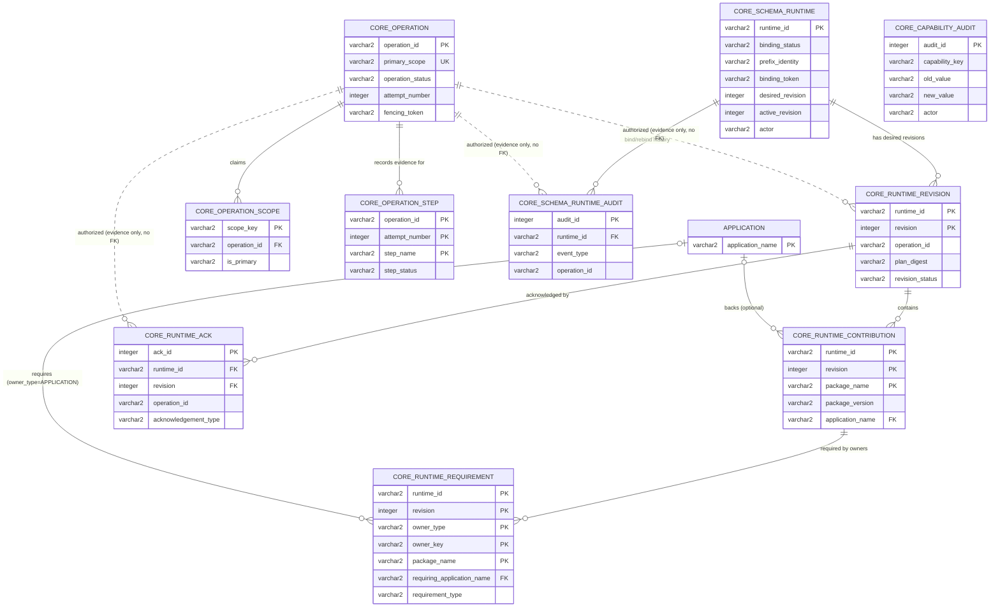

# Core Schema Runtime Architecture

## Status

Proposed architecture for the next Core integration effort. This document is
primarily for the person or agent implementing the Core changes. dbpm changes
are described only where they define or consume the Core contract.

This architecture supersedes the current dbpm assumption that a runtime prefix
is owned by one root application. No released dbpm version supports publicly
consumed packages with OS-runtime content, and the current lifecycle work is on
an unreleased development branch. The schema-runtime model can therefore be
introduced as the only supported model, without a dual-format transition or a
legacy migration contract.

This document originated in the dbpm repo; it moved here because it
primarily specifies Core's implementation, most of which now exists (Core
3.6.0: `PKG_CORE_OPERATION`, `PKG_CORE_SCHEMA_RUNTIME`, and the `CORE_`-prefixed
tables described below — table and package names here are illustrative per
the original design and were not updated to the as-built `CORE_` prefix; see
the Core repo's `Tables/` and `Packages/` directories for actual names). A
stub remains at `dbpm/docs/core-schema-runtime-architecture.md` pointing back
to this copy.

## Decision

An Oracle database schema is the deployment and runtime ownership boundary.
Within the currently supported colocated topology:

- a schema has zero or one managed runtime;
- that runtime has exactly one `DBPM_RUNTIME_PREFIX`;
- every installed application and package with runtime content contributes to
  that schema runtime;
- the active runtime receipt describes the complete schema runtime, not one
  root application's runtime; and
- a package contribution is logical ownership metadata, not a separate
  filesystem prefix or runtime instance.

In this model, the phrase "a dependency contributes a payload to another
application's runtime" is replaced with "the package contributes a payload to
the schema runtime." Applications and packages still need contribution records
so Core and dbpm can decide what remains required after an uninstall, but all
contributions share the same physical prefix.

## Why Core needs runtime awareness

Core is already authoritative for installed applications, dependencies,
deployment history, object ownership, and database cleanup. A schema-wide
runtime cannot be managed safely from filesystem receipts alone because Core
must be able to answer:

- whether the schema is expected to have a runtime;
- which installed applications require runtime contributions;
- which package payloads are part of the desired aggregate runtime;
- which runtime generation and receipt checksum most recently acknowledged
  that desired state;
- whether runtime activation is active, pending, unreachable, or removed; and
- whether an environment reset left a runtime instance that did not
  acknowledge removal.

This is metadata and lifecycle authority, not filesystem management. Core must
not execute runtime hooks, inspect local paths, create symlinks, or decide what
live files mean. Those remain dbpm responsibilities on the runtime host.

## Goals

1. Bind one schema to one logical runtime and one configured prefix.
2. Represent the complete desired runtime as a set of package contributions.
3. Preserve enough authoritative evidence to detect wrong-target operations,
   drift, offline hosts, and incomplete removal.
4. Let dbpm calculate and activate a schema-wide runtime graph without using
   one application as the filesystem owner.
5. Support source-free uninstall, graph reinstall, environment reset, resume,
   reconciliation, and Phase 4 remnant reporting.
6. Keep database-local state transitions, leases, fencing, and auditing behind
   supported Core procedures.
7. Leave room for a future multi-host model without implementing it now; see
   [`core-schema-runtime-multi-host-followup.md`](core-schema-runtime-multi-host-followup.md)
   for a sketch of that extension.

## Non-goals

- Core does not read or mutate the runtime filesystem.
- Core does not store executable hook bodies or rendered scripts.
- Core does not infer ownership from path or object naming conventions.
- This design does not support multiple active prefixes for one schema.
- This design does not support multiple runtime hosts for one schema.
- This design does not make package manifests authoritative for target policy.
- This design does not replace the verified filesystem lifecycle receipt.

## Terminology

### Schema runtime

The single logical runtime associated with the current Oracle schema. It is
identified by a Core-generated immutable ID and bound to one runtime prefix in
the supported topology.

### Runtime contribution

One package version's declared payload, commands, lifecycle metadata, and
artifact identity as included in the schema runtime. Several applications may
require the same contribution.

### Runtime requirement

The relationship explaining why an installed application or an explicitly
installed runtime-only root requires a runtime contribution. Requirements,
rather than filesystem presence, determine whether a contribution remains in
the desired runtime after an owner is removed.

### Desired runtime

The complete contribution and command set that should be active for the
schema's current installed application graph.

### Acknowledged runtime

The generation and verified receipt checksum that a runtime host reports as
successfully activated for the desired runtime revision.

## Architectural invariants

Core must enforce these invariants:

1. At most one non-retired schema-runtime record exists in a schema.
2. A schema runtime has one immutable `runtime_id`.
3. One physical prefix must not represent more than one schema runtime; because
   isolated schemas cannot enforce cross-schema path uniqueness in SQL, dbpm
   enforces this by verifying the Core-issued binding token in the aggregate
   filesystem receipt before mutation.
4. One desired revision identifies one complete contribution set; it is never
   interpreted as a partial patch to an unknown prior set.
5. A desired revision contains at most one contribution per `package_name`.
   Two installed applications that require different versions of the same
   package is a version conflict, detected and rejected at
   `stage_runtime_revision` time — it never produces two sibling
   `RUNTIME_CONTRIBUTION` rows for the same package name. This closes a real
   gap: `RUNTIME_CONTRIBUTION`'s natural key of `(package_name,
   package_version)` would otherwise permit two versions of the same package
   to both be desired, which the command/alias uniqueness rule below cannot
   tolerate if both versions export the same command name.
6. An acknowledgement applies only to the desired revision, operation,
   receipt checksum, and fencing token for which it was recorded.
7. An expired or superseded operation attempt cannot acknowledge or remove a
   runtime revision.
8. A contribution remains desired while at least one application or manual
   runtime-root requirement references it.
9. Removing a requirement owner cannot remove a contribution still required by
   another surviving owner.
10. `DEPLOY_LOCKED=Y` and missing lifecycle capabilities remain authoritative
    over runtime replacement and reset operations.
11. Core never treats a path supplied by dbpm as executable input.
12. CORE itself is structurally excluded from application and environment
    removal plans.

## Proposed Core logical model

Names below are illustrative. The Core maintainer may choose names consistent
with existing conventions, but the relationships and constraints are required.

### `SCHEMA_RUNTIME`

One row for the schema's current runtime binding.

| Field | Purpose |
| --- | --- |
| `runtime_id` | Core-generated immutable identifier. |
| `binding_status` | Whether the binding is `BOUND` or `REMOVED`; no current row means unbound. |
| `prefix_identity` | Canonical or opaque identity for `DBPM_RUNTIME_PREFIX`; never executable. |
| `binding_token` | Random value also stored in the filesystem receipt to prevent accidental cross-schema use. |
| `desired_revision` | Monotonically increasing complete desired-state revision. |
| `active_revision` | Last revision successfully acknowledged as active; unchanged while a newer desired revision is pending or failed. |
| `active_generation` | Last acknowledged filesystem generation. |
| `active_receipt_checksum` | Receipt checksum acknowledged for the active generation. |
| `transition_status` | State of the desired transition: `IDLE`, `PENDING`, `REMOVAL_PENDING`, or `FAILED`. |
| `reachability_status` | Latest host observation: `UNKNOWN`, `REACHABLE`, or `UNREACHABLE`. |
| `current_operation_id` | Operation responsible for the pending transition. |
| `last_acknowledged_at` | Timestamp of the latest valid host acknowledgement. |
| `created_at`, `updated_at` | Core audit timestamps. |

There should be a uniqueness constraint ensuring one current runtime binding.
Do not emulate this row with unrelated `APP_DICTIONARY` keys.

`prefix_identity` may initially be the normalized absolute prefix because the
scope is one colocated host. `binding_token` is the stronger identity: the same
token in Core and the verified runtime receipt binds the filesystem prefix to
the target schema without relying only on a path string.

A removed or replaced binding is immutable historical evidence, not a record
to reactivate. Binding a new prefix after removal, or explicitly replacing the
prefix of a bound runtime, creates a new `runtime_id` and `binding_token` and
retires the prior binding as a tombstone. The uniqueness constraint applies to
the one non-retired binding; historical tombstones remain queryable. Reusing a
prior identity would allow a receipt left at an old prefix to appear current
again and is prohibited.

### `RUNTIME_REVISION`

An immutable header for each desired schema-runtime revision.

| Field | Purpose |
| --- | --- |
| `runtime_id`, `revision` | Composite identity. |
| `operation_id`, `attempt_number` | Fenced operation that proposed the revision. |
| `plan_digest` | Digest of the normalized database/runtime plan, computed and stored at staging time. |
| `revision_status` | `STAGED`, `DATABASE_COMPLETE`, `ACTIVE`, `SUPERSEDED`, `REMOVED`, or `FAILED`. |
| `created_at`, `completed_at` | Audit timestamps. |

`RUNTIME_REVISION` deliberately has no `receipt_checksum` field. The receipt
cannot exist until dbpm knows the `revision` number Core assigns when staging
completes, so a checksum of that receipt cannot be an input to staging or a
value staged alongside `plan_digest` — requiring one there would make staging
depend on its own output. `plan_digest` is what staging validates against: it
is computed from the normalized contribution/requirement set before the
revision number is known, so it carries no such circularity. The receipt's
checksum is recorded once, as evidence, in `RUNTIME_ACKNOWLEDGEMENT` below,
after the receipt has actually been written. See "Receipt checksum sequencing"
under `stage_runtime_revision` for the concrete ordering.

Retaining revision history makes runtime drift and offline reconciliation
auditable without turning Core into an artifact store.

### `RUNTIME_CONTRIBUTION`

The package identities contained in a complete runtime revision.

| Field | Purpose |
| --- | --- |
| `runtime_id`, `revision` | Owning desired revision. |
| `package_name`, `package_version` | Package identity. |
| `application_name` | Core application identity when the package has a database component; nullable for runtime-only packages. |
| `artifact_uri` | Recorded artifact coordinate or source identity. |
| `artifact_checksum`, `checksum_algorithm` | Immutable content identity. |
| `payload_digest` | Digest of the declared runtime payload contribution. |
| `manifest_digest` | Digest of the verified package manifest. |

The contribution table records identity and evidence. Hook paths, environment
variables, and executable contents remain in verified artifacts and receipts.
There is no `installation_reason` field: a contribution's reason for being
desired is not a single fixed value once more than one owner can require it.
That information lives in `RUNTIME_REQUIREMENT`, one row per requirement owner.
A field on the contribution itself would be ambiguous the moment another owner
requires the same package for a different reason.

### `RUNTIME_REQUIREMENT`

Why an installed application or manual runtime-only root needs a contribution.

| Field | Purpose |
| --- | --- |
| `runtime_id`, `revision` | Desired revision. |
| `owner_type` | `APPLICATION` or `MANUAL_RUNTIME_ROOT`. |
| `owner_key` | Application name or normalized runtime-root package name. |
| `requiring_application_name` | Nullable application foreign key; required only when `owner_type=APPLICATION`. |
| `package_name`, `package_version` | Required contribution. |
| `requirement_type` | Root, direct dependency, or transitive dependency. |

This relationship is necessary even though all contributions share one prefix.
It prevents uninstalling one application from removing a shared package needed
by another owner. Core must enforce the conditional application foreign key and
must reject a `MANUAL_RUNTIME_ROOT` owner unless its stable root identity and
root contribution are present in the submitted complete revision. This permits
an explicitly installed runtime-only package to own a dependency graph without
creating a fake `APPLICATION` row.

For `MANUAL_RUNTIME_ROOT`, `owner_key` is the normalized `package_name` of the
explicitly installed root contribution. It never includes `package_version`, so
the owner identity remains stable across upgrades. Core must verify that the
revision contains exactly one matching root contribution and must reject an
owner key that does not match that contribution's normalized package name.

### `RUNTIME_ACKNOWLEDGEMENT`

Durable evidence received from dbpm after filesystem work.

| Field | Purpose |
| --- | --- |
| `runtime_id`, `revision` | Acknowledged revision. |
| `operation_id`, `attempt_number`, `fencing_token` | Operation authority. |
| `generation` | Activated filesystem generation. |
| `receipt_checksum` | Verified aggregate receipt checksum. |
| `acknowledgement_type` | `ACTIVE`, `VALIDATED`, `UNREACHABLE`, or `REMOVED`. |
| `acknowledged_at` | Core timestamp. |

Acknowledgements should be append-only evidence. Core maintains the current
binding, active state, desired state, transition state, and latest reachability
observation transactionally.

### Active state, desired state, and transition state

The runtime currently exposed by the host must not be conflated with the newest
desired transition. In particular, staging revision 2 must not make an active
revision 1 appear inactive, and a failure or unreachable host while activating
revision 2 must not erase the evidence that revision 1 was last acknowledged.

Core applies these rules:

- `active_revision` is the last revision successfully acknowledged as active.
  It changes only after a valid `ACTIVE` or `REMOVED` acknowledgement.
- `desired_revision` is the complete target state of the current or most recent
  transition. It may be newer than `active_revision`.
- staging a revision sets `transition_status=PENDING`; recording database
  completion leaves it pending;
- a valid activation acknowledgement sets `active_revision=desired_revision`,
  marks the new revision `ACTIVE`, marks the former active revision
  `SUPERSEDED`, sets `transition_status=IDLE`, and records the host as
  `REACHABLE`;
- a failed transition sets `transition_status=FAILED` but leaves
  `active_revision` and its acknowledgement evidence unchanged. A resumable
  desired revision retains its staged lifecycle state; Core marks it `FAILED`
  only when the revision is explicitly abandoned;
- an unreachable observation sets `reachability_status=UNREACHABLE` but does
  not itself change either revision's lifecycle or claim that the active
  runtime disappeared; and
- removal uses `transition_status=REMOVAL_PENDING`. A valid removal
  acknowledgement clears `active_revision`, sets `binding_status=REMOVED`,
  marks the formerly active revision `SUPERSEDED`, marks the removal revision
  `REMOVED`, and returns the transition to `IDLE`.

Core must change these fields in the same transactions that record revisions
and acknowledgements. Consumers must never infer what the host currently
exposes from `desired_revision` or the latest revision status alone.

## Entity relationship diagram

Reflects the tables as implemented in Core 3.6.0 (`CORE_`-prefixed; see
`Tables/` for the authoritative DDL). Dashed lines carry real information —
`operation_id`/`attempt_number` are stored as evidence of which fenced
operation authorized a row, but are deliberately **not** foreign-key
constrained back to `CORE_OPERATION`, since operation rows are reused and
re-fenced across resumed attempts rather than retained as permanent history.
`CORE_OPERATION_LOCK` is a single-row serialization gate with no foreign
keys in either direction and is omitted below for that reason.



`CORE_CAPABILITY_AUDIT` has no foreign keys of its own — it audits
`DBPM_ALLOW_*`/`DBPM_LIFECYCLE` changes in the pre-existing `APP_DICTIONARY`
table by key name, independent of any runtime or operation.

## Runtime ownership and composition

Physical colocation does not remove the need for logical ownership.

When application A and application B both require package P:

- P appears once in the desired contribution set;
- A-to-P and B-to-P requirements both exist;
- removing A removes only A's requirement;
- P remains desired because B still requires it; and
- P is removed from a later desired revision only after no surviving
  requirement references it.

Runtime-only packages need contribution identity even when they have no row in
Core's existing `APPLICATION` table. Do not create fake database application
registrations solely to make runtime packages fit that table. Use the runtime
contribution model and relate it through requirements to real applications or
to a stable manual-runtime-root identity.

## Commands and activation policy

The schema runtime has one aggregate `bin` namespace. dbpm remains responsible
for resolving exported commands, aliases, disabled commands, and collisions
before mutation. Core should record a digest of the resulting desired runtime,
not reproduce command-resolution logic.

The current concept of a root application controlling all aliases must be
replaced with a schema-level activation policy. The initial policy may be:

- canonical command names must be unique across the schema runtime;
- aliases must be declared by an application that directly requires the
  contributing package;
- two applications requesting incompatible aliases fail planning; and
- disabling another application's command requires an explicit schema-level
  override, not ordinary package metadata.

The exact schema-level configuration surface is a dbpm design decision, but
Core must store the digest and audit identity of the accepted aggregate plan.

## `etc` and `var` ownership

A schema-wide prefix also means schema-wide `etc` and `var` directories. Core
does not manage their files, but ownership evidence must not be lost.

Preferred conventions are:

```text
etc/<application-or-package>/...
var/<application-or-package>/...
```

Flat shared paths remain possible for compatibility, but manifests must declare
their logical owner and preserved-state category. Core should retain the
verified manifest digest and contribution identity used for an operation;
dbpm's aggregate receipt retains exact path classification. Ambiguous ownership
must be reported and preserved, never guessed or automatically deleted.

## Core API surface

Core should expose supported procedures and query functions. Exact package
names may follow Core conventions; examples below describe behavior.

```text
get_schema_runtime
bind_schema_runtime
begin_and_acquire_operation
stage_runtime_revision
get_runtime_revision
acknowledge_runtime_active
record_runtime_unreachable
begin_runtime_removal
acknowledge_runtime_removed
list_runtime_contributions
list_runtime_requirements
renew_operation_lease
record_operation_step
release_operation_lease
```

### `bind_schema_runtime`

- Creates the one schema-runtime record or verifies the existing binding.
- Generates the immutable `runtime_id` and `binding_token` inside Core.
- Rejects a different prefix identity unless the runtime-replacement capability
  and an explicit rebind operation are present.
- On an authorized rebind, retires the old binding and creates a new
  `runtime_id` and `binding_token`; it never updates the old binding in place.
- Returns data suitable for writing to the aggregate filesystem receipt.

When the runtime host is reachable, dbpm should submit its resolved canonical
path as `prefix_identity` so comparisons and diagnostics do not vary because
of relative segments, trailing separators, or symlink spellings. Core treats
that value as opaque supporting evidence and performs no path normalization.

Path canonicalization is not an ownership proof: paths can move, symlinks can
be repointed, and isolated schemas cannot enforce cross-schema path uniqueness.
The authoritative binding is the Core-issued `runtime_id` and `binding_token`
recorded in both Core and the verified filesystem receipt. A binding-token
mismatch always fails closed. A prefix-identity mismatch is contradictory
target evidence handled by the explicit rebind/reconciliation policy; it must
not silently create a new binding or override a valid token.

### `stage_runtime_revision`

- Requires a valid operation lease and fencing token.
- Accepts the complete normalized contribution and requirement set, and their
  `plan_digest`. It does not accept a receipt checksum — see "Receipt
  checksum sequencing" below.
- Validates installed application references and dependency consistency.
- Creates an immutable desired revision and assigns its `revision` number.
- Returns the assigned `revision` number to the caller.
- Advances `SCHEMA_RUNTIME.desired_revision` transactionally.
- Does not claim that filesystem activation has occurred.

For large contribution sets, use Core collection types, JSON validated inside
Core, or a supported staging table owned by Core. Do not require dbpm to issue
direct DML against Core tables.

#### Receipt checksum sequencing

The aggregate receipt embeds `runtime_id` and `revision`, so it cannot be
written until `stage_runtime_revision` has already returned that revision
number — a receipt checksum cannot be a staging input without creating a
circular dependency. The required order is:

1. dbpm submits the normalized plan and `plan_digest` to `stage_runtime_revision`.
2. Core assigns and returns the `revision` number.
3. dbpm executes database and filesystem lifecycle work and writes the
   aggregate receipt, now able to embed the assigned `runtime_id` and
   `revision`.
4. dbpm computes the receipt's checksum and submits it to
   `acknowledge_runtime_active`, which stores it as acknowledgement evidence
   rather than verifying it against a value staged earlier.

### `acknowledge_runtime_active`

- Requires the current operation, attempt number, and fencing token.
- Verifies the acknowledged revision is the schema's current staged desired
  revision and that the receipt's contribution set matches the revision's
  `plan_digest`; this — not a pre-staged receipt checksum — is what proves
  the receipt corresponds to the staged plan.
- Records the caller-supplied receipt checksum as new acknowledgement
  evidence (`RUNTIME_ACKNOWLEDGEMENT.receipt_checksum` and, transactionally,
  `SCHEMA_RUNTIME.active_receipt_checksum`); this is the first time Core
  learns this value, not a comparison against a prior expectation.
- Records the activated generation and evidence.
- Makes the acknowledged revision active and completes the pending transition.
- Rejects stale, expired, or superseded acknowledgements.

### Runtime removal

Removal is a state transition, not deletion of the runtime record:

1. Core records `REMOVAL_PENDING` for the desired empty contribution set.
2. dbpm removes managed runtime content using verified receipt-backed hooks.
3. dbpm acknowledges removal with the binding token and receipt evidence.
4. Core records `REMOVED` and retains a tombstone for auditing.

If the runtime host is unreachable, Core records the unreachable observation
and leaves removal pending; it does not manufacture a removal acknowledgement
or discard the last active revision. Database cleanup may continue according
to policy, and later reconciliation compares the host against Core's latest
desired revision.

## Lifecycle flows

### Install or upgrade

1. dbpm reads installed application and schema-runtime state from Core.
2. dbpm resolves the complete desired database and runtime graph.
3. dbpm verifies capabilities and snapshots mutable artifacts.
4. dbpm acquires one fenced Core operation for the schema transition.
5. dbpm submits the complete desired runtime revision to Core.
6. dbpm executes database lifecycle work.
7. dbpm stages and atomically activates the schema runtime generation.
8. dbpm writes the aggregate receipt containing `runtime_id`, binding token,
   revision, generation, plan digest, and contribution identities.
9. dbpm acknowledges activation and validation to Core.

### Application uninstall

1. Core supplies installed applications, dependencies, and current runtime
   requirements.
2. dbpm calculates the surviving application graph.
3. dbpm calculates a complete new runtime revision from surviving
   requirements.
4. Database removal and runtime activation execute under one fenced operation.
5. Shared contributions remain when any surviving requirement needs them.
6. Core records the new active revision after host acknowledgement.

### Environment reset

1. Core verifies health and `DBPM_ALLOW_ENVIRONMENT_RESET`.
2. Core supplies every non-CORE application and the one schema-runtime binding.
3. dbpm previews consumer-first database removal, aggregate runtime removal,
   preserved-state classifications, and the target binding identity.
4. The operator confirms the schema/environment and runtime prefix.
5. dbpm removes managed runtime content and non-CORE applications under one
   fenced schema operation.
6. Core verifies only CORE remains and records the runtime tombstone.

The command no longer needs a repeatable list of unrelated application runtime
prefixes. It needs the one configured schema prefix and must verify its receipt
against Core's `runtime_id` and binding token.

### Reconciliation

Reconciliation targets Core's latest desired revision, not an arbitrary prior
application receipt. Missing or identical files may be repaired normally.
Conflicting replacement remains capability-gated. A host presenting a
different binding token is the wrong runtime and must fail closed.

## Core transaction and concurrency requirements

Runtime state transitions must use the same Core-owned operation API planned in
[`core-operation-api-followup.md`](core-operation-api-followup.md).

- Beginning the schema operation and acquiring its first lease must be atomic.
- Runtime revision staging must be fenced by operation attempt and token.
- Application registry changes and desired runtime revision changes should
  commit at an explicitly documented boundary.
- Filesystem activation cannot share the database transaction, so durable
  evidence must support roll-forward recovery.
- Core must never infer filesystem success from database deployment status.
- A failed acknowledgement must leave the desired revision recoverable by
  `resume` or runtime reconciliation. If filesystem activation partially
  completed before the acknowledgement call failed or the process died, the
  retry on `resume` re-executes the same lifecycle hooks against the same
  target state; this relies on the hook-idempotency guarantee already
  established for the current per-application lifecycle model (see
  `development-lifecycle-design.md`'s Phase 1 requirement that hooks be safe
  to invoke again after a partial or interrupted run), which this
  architecture does not need to re-specify — an aggregate runtime
  activation is still, at the filesystem level, the same idempotent hook
  execution model applied to a larger contribution set.

The schema-wide runtime means application-scoped operation slots are
insufficient for mutations that change aggregate runtime state. Core needs a
schema-runtime operation scope so two otherwise unrelated application installs
cannot concurrently publish incompatible revisions of the same prefix.

### Lease scopes and conflict hierarchy

Current dbpm (`db.py`) keys `begin_operation`/`acquire_operation_lease` by
`application_name`. Core must extend that model with explicit hierarchical
conflicts rather than asking dbpm to select one unrelated scope and assuming
the scopes never overlap.

| Scope | Protects | Conflicts with |
| --- | --- | --- |
| `SCHEMA_LIFECYCLE` | The whole schema lifecycle. | Every schema-lifecycle, schema-runtime, and application mutation in the schema. |
| `SCHEMA_RUNTIME` | The aggregate schema runtime and its desired revision. | `SCHEMA_LIFECYCLE` and another schema-runtime mutation. |
| `APPLICATION:<name>` | One application's database state. | `SCHEMA_LIFECYCLE` and another mutation of the same application. |

The atomic `begin_and_acquire_operation` API should accept the primary scope
and all participant application scopes, validate their conflicts, and claim
them as one operation. Core must use a deterministic claim order internally so
multi-application graph operations cannot deadlock.

The operational rules are:

- an install, upgrade, uninstall, or reconciliation that changes aggregate
  runtime state claims `SCHEMA_RUNTIME` plus every affected application scope;
- a purely database-only single-application operation claims only its
  `APPLICATION:<name>` scope;
- environment reset and similarly schema-wide destructive work claim
  `SCHEMA_LIFECYCLE`, excluding every concurrent mutation in the schema; and
- a database-only graph operation atomically claims all affected application
  scopes, or conservatively claims `SCHEMA_LIFECYCLE` when Core cannot express
  that participant set safely.

The scope decision and participant validation must be based on the current and
proposed graph supplied to Core's authoritative operation API, not on an
untrusted caller flag saying that an operation is database-only.

## Authority model

Highest to lowest authority for runtime decisions:

1. Core deployment lock and lifecycle capabilities.
2. Current fenced Core operation and desired runtime revision.
3. Verified immutable artifacts and aggregate operation receipt.
4. Core installed application and runtime-requirement state.
5. Verified active filesystem receipt bound by `runtime_id` and binding token.
6. Live filesystem as observed state only.

A path string, environment variable, or local profile must not override a Core
binding or capability decision.

## Security requirements

- Generate runtime IDs and binding tokens with database-local cryptographic
  randomness where available.
- `binding_token` is a collision-avoidance value, not a secret: its job is to
  let dbpm and Core detect that a filesystem prefix was accidentally reused
  across schemas, not to gate access to anything. It may appear in the
  aggregate lifecycle receipt on disk and in ordinary log output. The
  existing receipt file permissions (mode `0o600`, the same convention
  `lifecycle.py` already applies to installed lifecycle receipts) are
  sufficient protection; no additional encryption or secret-handling is
  required.
- Do not expose database credentials in runtime records, receipts, logs, or
  procedure output.
- Authorize runtime binding, replacement, reset, and capability changes through
  Core's existing administration model.
- Audit actor, operation, attempt, old value, new value, and timestamp.
- Validate JSON or collection inputs completely before changing desired state.
- Enforce contribution and requirement uniqueness with database constraints.
- Retain tombstones rather than allowing an offline old prefix to appear
  current after database cleanup.
- Never return executable hook content from Core.

## Phase 4 auditing support

The model supplies authoritative evidence for Phase 4's runtime audit tier:

- registered desired contribution but missing host acknowledgement;
- active Core revision but missing or mismatched filesystem receipt;
- runtime generation acknowledging a superseded revision;
- removal pending or unreachable;
- tombstoned runtime still present on the host; and
- filesystem payload with no contribution in the desired revision.

Core can report the database-side facts. dbpm combines them with a verified
receipt and live filesystem observation. Convention-only filesystem matches
remain suspected remnants and must never be deleted automatically.

## No migration from a prior model

No released dbpm version supports publicly consumed packages with OS-runtime
content, and the implementation being replaced exists only on an unreleased
development branch. Breaking the development-only per-root receipt model is
therefore intentional. The first release of this capability uses only the
schema-runtime model; it does not read both formats or expose a legacy migration
mode.

Implementation should replace the development model, receipts, and tests as one
coherent change. Database-only schemas need no runtime row until a package
contributes runtime content.

## Required dbpm changes

These are consumers of the Core architecture, not Core implementation details:

- Treat `DBPM_RUNTIME_PREFIX` as schema-scoped configuration.
- Replace root-application receipt ownership with `runtime_id` and binding-token
  verification.
- Build one aggregate runtime plan from all installed and proposed
  contributions, not only the current application's dependency graph.
- Replace root-controlled command aliases with schema-level activation policy.
- Write and verify aggregate schema-runtime receipts.
- Submit complete desired revisions through Core procedures.
- Remove the repeatable `--runtime-prefix` argument from environment reset;
  the schema runtime is discovered from Core, not supplied by the operator.
  This also removes the need for the `unscoped_applications` warning
  mechanism dbpm currently prints when an application is removed without a
  matching `--runtime-prefix` — that gap cannot exist once there is exactly
  one schema-discovered prefix instead of a per-application list.
- Reconcile and audit against Core's current desired revision.

dbpm should call supported Core procedures through thin SQL*Plus/SQLcl-compatible
wrappers. It must not implement Core table DML or locking rules in generated
anonymous PL/SQL blocks.

## Core implementation sequence

1. Finalize the logical table and constraint design.
2. Add the schema-runtime operation scope to Core's atomic lease API.
3. Implement runtime binding and query procedures.
4. Implement immutable revision, contribution, and requirement staging.
5. Implement fenced acknowledgement and removal transitions.
6. Add policy authorization and audit records.
7. Add Core unit and concurrency tests.
8. Publish the minimum compatible Core version and compatibility contract.
9. Integrate dbpm aggregate planning and receipts.
10. Exercise install, shared dependency, uninstall, offline host, and
    environment reset scenarios against a real Oracle schema.

## Acceptance criteria

This architecture is implemented when:

- Core enforces zero-or-one active runtime binding per schema;
- the Core binding and aggregate filesystem receipt share a verified
  `runtime_id` and binding token;
- removal or prefix replacement retires the prior binding and issues a new
  `runtime_id` and binding token rather than reactivating old receipt identity;
- two unrelated application operations cannot concurrently mutate the schema
  runtime;
- environment reset excludes every concurrent application and runtime mutation
  in the schema;
- Core stores complete immutable desired revisions with package contributions
  and application or manual-runtime-root requirements;
- staging or failing a newer desired revision leaves the last acknowledged
  active revision intact and queryable;
- removing one application retains every contribution required by surviving
  owners;
- staging a desired revision rejects a version conflict (two installed
  applications requiring different versions of the same package) rather than
  producing two sibling contributions for the same package name;
- explicitly installed runtime-only roots and their dependencies are
  represented without fake `APPLICATION` rows, using normalized package name
  as the version-independent root owner identity;
- activation, unreachable, reconciliation, and removal acknowledgements are
  fenced and auditable;
- environment reset discovers the schema runtime from Core and does not require
  a list of application-owned prefixes;
- a wrong-schema or wrong-prefix receipt fails closed before database or
  filesystem mutation;
- Phase 4 can distinguish missing acknowledgement, drift, superseded runtime,
  and tombstoned-but-present runtime evidence;
- Core contains no filesystem execution logic or executable hook content; and
- dbpm uses supported Core procedures rather than direct runtime-state DML.

## Open implementation choices

The architecture intentionally leaves these details to the Core implementer:

- exact table, sequence, package, and type names;
- JSON versus Core collection types for staging complete revisions;
- retention duration for superseded runtime revisions and acknowledgements;
- whether `prefix_identity` stores a canonical path, a host-qualified URI, or
  only an opaque display value alongside the binding token; and
- the schema-level command alias configuration surface consumed by dbpm.

None of these choices may weaken the one-runtime-per-schema invariant, fencing,
binding-token verification, or complete desired-state semantics.
